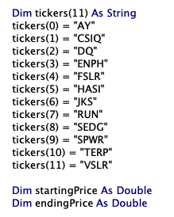
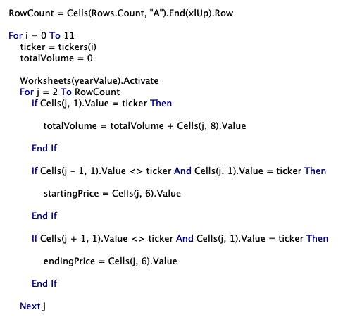
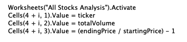
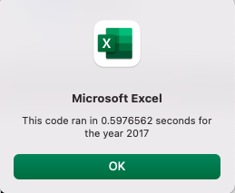
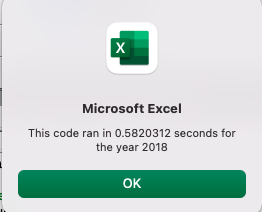
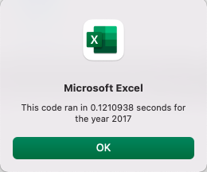
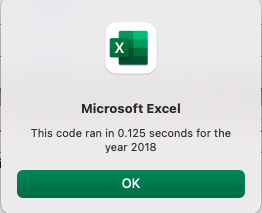
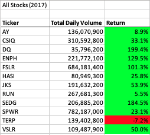
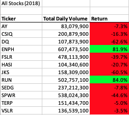

# VBA of Wall Street

## Overview of Project

### Purpose:
- Using stock market data from 2017 and 2018 focused on 12 stocks of interest, this analysis helped create a repeatable macro that my friend Steve could use to quickly sift through stock market data. By utilizing the macro, Steve could calculate total trading volume and the yearly overall performance of a stock in a fraction of the time it could take him to manually calculate the statistics he was interested in.

## Results

### Stock Yearly Comparison

To begin my analysis, I was presented with over 3,000 rows of data in two separate sheets: one for 2017 data and the other for 2018 data. In my initial macro I created, I used nested for loops to iterate through all the rows of data 12 times, correlating with the number of different stocks Steve and I were tracking. I created an array to house the individual stock tickers for all 12 stocks, as well as two variables to house the individual starting and ending prices for each stock:

To go through all the data and calculate the volume and starting/ending prices for each stock, I first archived the number of rows in a RowCount variable using the following code: RowCount = Cells(Rows.Count,"A").End(xlUp).Row. Next, I used a nested for loop to sift through every row, obtaining the total volume, starting price, and ending price for every stock:

Before iterating through once again with the next stock in the array, I added the values for the current stock into our "All Stocks Analysis" sheet using the following code:

The run times for this initial macro were as follows:

### 2017

### 2018

In an effort to streamline my code, I refactored it to try and cut time off of the analysis by only iterating through the data once instead of twelve times. To do so, I created a tickerIndex variable that could house the index of each ticker that could then be increased when a row changed to a new ticker symbol. By refactoring the code in this way, I was able to go through all the data in a fifth of the time.

### 2017

### 2018

After running our new refactored macro, the stock performance for 2017 was as follows:

2017 was a great year for almost all of the stocks we were tracking, other than "TERP", which was the only stock that didn't have an increased price by the end of the year. Four stocks ("DQ", "ENPH", "FSLR", and "SEDG") at least doubled their value, while "DQ" nearly tripled in value! However, 2018 was a different story:

Every stock other than "ENPH" and "RUN" decreased in value by years end, while "ENPH" and "RUN" nearly doubled in value. Given the analysis of the past couple years, I would take a good long look at investing in "ENPH" given its increased value in what looks like a "down" year for other areas of the market. 

### Summary

Refactoring code has a number of advantages and disadvantages. One advantage is cutting the time needed to run a piece of code, expediting an analysis and removing redundancies. One disadvantage is the time needed on the front end to ensure our shortened code runs the same, being especially careful in tracking our variables and any syntax errors. 

In terms of how these pros and cons apply to our analysis, as mentioned above we were able to analyze the stock data in a fifth of the time it took us to do it with our nested for statements. However, there was occasional trial and error when getting the code to produce the same output given more variables to keep track of and syntax challenges that needed to be taken into consideration. 
